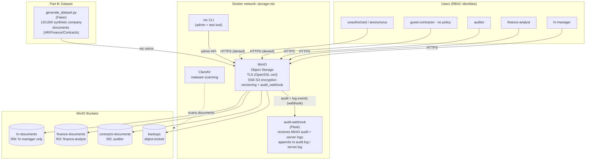

# System Architecture — Group 4: Secure Cloud Storage

## Components

| Layer | Component | Role |
|---|---|---|
| Data source | `dataset/generate_dataset.py` | Generates 120,000 synthetic company documents (HR records, finance invoices, contracts) with Faker |
| Storage platform | MinIO | S3-compatible object storage; TLS, SSE-S3 encryption, versioning, IAM/RBAC, audit webhook |
| Security tool #1 | OpenSSL | Issues the root CA + server certificate used for TLS; also usable for ad-hoc file encryption |
| Security tool #2 | ClamAV | Malware scanning of uploaded documents |
| Logging | `audit-webhook` (Flask) | Receives MinIO audit + server log events over HTTP, persists as JSON Lines, exposes a query API |
| Orchestration | Docker Compose | Wires all services on an isolated `storage-net` bridge network |

## Data flow

1. `scripts/gen_certs.sh` issues a root CA and MinIO server certificate (OpenSSL).
2. `docker compose up` starts MinIO (TLS-only), the audit-webhook receiver, and ClamAV.
3. `minio/init/init-minio.sh` creates buckets, enables versioning + SSE-S3 encryption, creates IAM policies and 4 RBAC users.
4. `dataset/generate_dataset.py` + `build_manifest.py` generate the dataset and a SHA-256 integrity manifest.
5. `minio/init/upload_dataset.sh` uploads the dataset into the matching buckets.
6. `security-tests/*.sh` exercise the environment (RBAC, TLS, encryption, integrity, logging, malware scanning, backup/recovery) and write evidence to `evidence/`.
